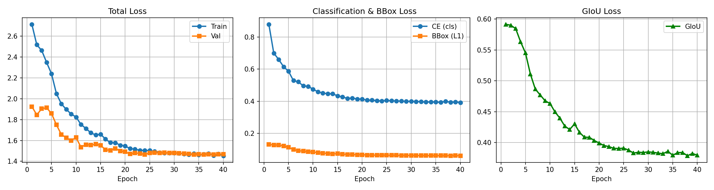
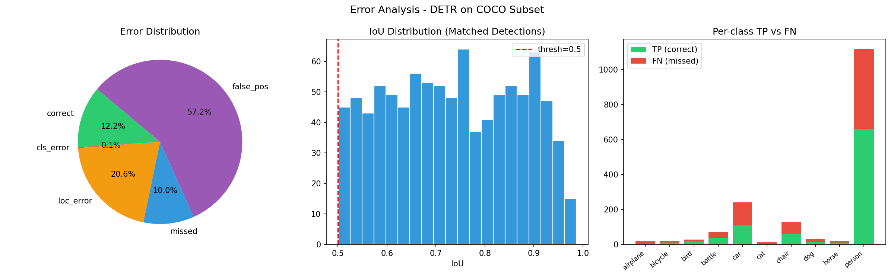
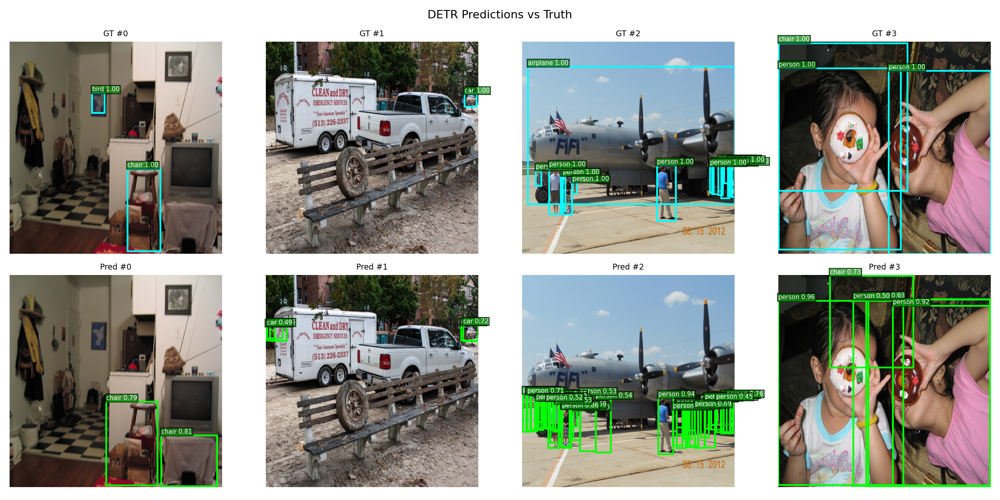
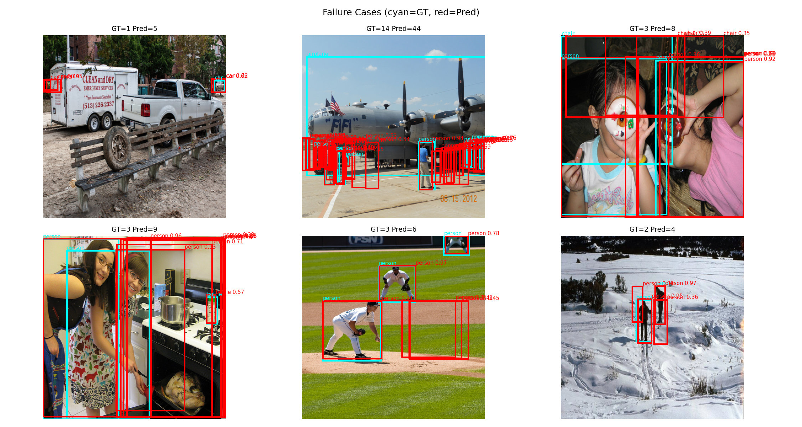

# DETR Fine-tuning на подмножестве COCO

## 1. Описание эксперимента

Fine-tuning предобученного **DETR (facebook/detr-resnet-50)** из библиотеки HuggingFace
`transformers` на подмножестве датасета **COCO val2017**, содержащем 10 классов:

**person, car, dog, cat, bicycle, chair, bottle, bird, horse, airplane**

Изображения отбирались как все картинки val2017, содержащие хотя бы один объект
одного из выбранных классов; разбиение на train/val — 90% / 10%.
Метки классов перенумерованы в диапазон `1..10` под голову модели.

## 2. Гиперпараметры

| Параметр | Значение |
| --- | --- |
| Backbone / модель | `facebook/detr-resnet-50` (предобученная, с заменой классификационной головы) |
| Эпохи | 40 |
| Batch size | 4 |
| Размер изображения | 480 × 480 |
| Аугментации (train) | RandomHorizontalFlip(p=0.5), ColorJitter(brightness=0.3, contrast=0.3, saturation=0.2) |
| Optimizer | AdamW |
| LR (голова) | 1e-4 |
| LR (backbone) | 1e-5 |
| Weight decay | 1e-4 |
| Scheduler | StepLR (step_size=5, gamma=0.5) |
| Grad clipping | max_norm = 0.1 |
| Точность вычислений | Mixed precision (AMP, `torch.cuda.amp`) |
| Confidence threshold (инференс) | 0.4 |
| IoU threshold (error analysis) | 0.5 |

## 3. Кривые потерь



- **Total loss** — train и val сходятся плавно, без признаков переобучения; после
  20–25 эпохи обе кривые выходят на плато (train = 1.45, val = 1.47).
- **Classification loss (CE)** стабилизируется около 0.39.
- **BBox loss (L1)** стабилизируется около 0.06.
- **GIoU loss** снижается с 0.59 до ≈ 0.38.

**Наблюдение:** после эпохи 25 прирост качества по всем компонентам loss минимален —
обучение можно было бы сократить (early stopping) без потери качества.

## 4. Error Analysis





Распределение ошибок на val (IoU threshold = 0.5, confidence threshold = 0.4):

| Тип ошибки | Доля |
| --- | --- |
| correct | 12.2% |
| cls_error | 0.1% |
| loc_error | 20.6% |
| missed (FN) | 10.0% |
| false_pos | 57.2% |

**Ключевые наблюдения:**

- Доминирующий тип ошибки — **false positives (57.2%)**, а не путаница между
  классами (cls_error ≈ 0.1%). Модель почти никогда не ошибается в *названии*
  объекта, но генерирует избыточные предсказания.
- На `failure_cases.png` видно, что избыточные боксы — это в основном
  **дублирующиеся детекции одного и того же объекта** разными query (особенно
  заметно на классе `person`: кейс с самолётом GT=14 / Pred=44, кейс с креслом
  GT=3 / Pred=8). Похоже на типичную для DETR проблему недостаточно
  "острых" decoder queries при ограниченном числе эпох / данных.
- IoU-распределение совпавших боксов смещено в сторону высоких значений
  (большая часть matched-боксов лежит в диапазоне 0.6–0.95) — там, где модель
  всё-таки попадает в объект, локализация довольно точная.
- Per-class TP/FN: класс `person` сильно доминирует по количеству объектов в
  датасете, что создаёт дисбаланс классов; редкие классы (`cat`, `dog`, `bird`,
  `horse`, `bicycle`) получают заметно меньше сигнала при обучении.
- Класс `car` имеет повышенную долю FN относительно TP — модель пропускает
  заметную часть машин на сцене.

```
